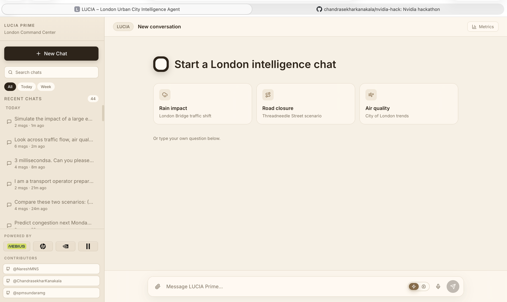

# nvidia-hack — LUCIA (London Urban City Intelligence Agent)

> An agentic AI system that runs entirely on NVIDIA DGX Spark. Ask questions about London's traffic, air quality, planning, and city operations — get non-obvious insights, simulations, and predictions.



---

## Quick Start (DGX Spark)

```bash
# 1. Clone and enter
git clone <repo-url> nvidia-hack && cd nvidia-hack/lucia

# 2. Copy environment config (EDIT THIS with your ElevenLabs key)
cp .env.example .env
nano .env    # Set LUCIA_ELEVENLABS_API_KEY=sk_your_key_here

# 3. Setup (installs everything — idempotent, safe to re-run)
bash scripts/setup.sh

# 4. Download London datasets (~20 files from data.london.gov.uk)
bash scripts/download_data.sh

# 5. Start all services (vLLM models, API, UI)
bash scripts/start.sh

# 6. Ingest data (loads into DuckDB + builds FAISS embeddings)
#    Requires services running for embeddings on :8002
source .venv/bin/activate
python3 scripts/ingest.py

# 7. Run tests (validates everything end-to-end)
bash scripts/test.sh quick

# 9. Open in browser (via SSH port-forward)
# From your laptop:
ssh -L 3000:localhost:3000 -L 8000:localhost:8000 user@dgx-spark
# Then open: http://localhost:3000
```

---

## What You Can Ask

| Mode | Example | Response Time |
|------|---------|---------------|
| ⚡ Light | "Traffic on London Bridge" | < 2s |
| ⚡ Light | "Air quality in Westminster?" | < 2s |
| 🧠 Deep | "What happens to traffic when it rains on a Friday?" | 5-15s |
| 🧠 Deep | "If I close Threadneedle St for 3 weeks, what's the impact?" | 5-15s |
| 🧠 Deep | "Predict congestion next Monday given rain forecast" | 5-15s |
| 🎤 Voice | Hold mic button → speak → get spoken response | < 4s |

---

## Architecture

```
┌─────────────────────────────────────────────────────────────────────────┐
│                         DGX Spark (Server)                              │
├─────────────────────────────────────────────────────────────────────────┤
│                                                                         │
│  ┌──────────────┐    WebSocket/REST   ┌───────────────────────────────┐ │
│  │   React UI   │◄──────────────────►│   FastAPI (port 8000)          │ │
│  │  (port 3000) │                     │   ├─ /ws/chat (streaming)     │ │
│  │              │                     │   ├─ /chat   (REST)           │ │
│  │  • Chat      │                     │   ├─ /voice/stt | /voice/tts  │ │
│  │  • Charts    │                     │   ├─ /sessions                │ │
│  │  • Voice     │                     │   └─ /health | /metrics       │ │
│  │  • History   │                     └──────────┬────────────────────┘ │
│  └──────────────┘                                │                      │
│                                                  ▼                      │
│                                   ┌────────────────────────────┐        │
│                                   │  NeMo Guardrails (Safety)  │        │
│                                   │  PII · Topic · Toxicity    │        │
│                                   └──────────────┬─────────────┘        │
│                                                  ▼                      │
│                                   ┌────────────────────────────┐        │
│                                   │  NemoClaw Agent Sandbox    │        │
│                                   │  (port 8080) Orchestration │        │
│                                   └──────────────┬─────────────┘        │
│                                                  ▼                      │
│                                   ┌────────────────────────────┐        │
│                                   │    Router (Intent Detect)   │        │
│                                   │  Fast-path + LLM fallback  │        │
│                                   └──────────────┬─────────────┘        │
│                                                  │                      │
│              ┌────────────┬──────────┬───────────┼───────────┬────────┐ │
│              ▼            ▼          ▼           ▼           ▼        ▼ │
│       ┌──────────┐ ┌──────────┐ ┌─────────┐ ┌────────┐ ┌────────┐ ┌───────┐
│       │SQL Query │ │RAG Search│ │Visualize│ │  Web   │ │Simulate│ │Predict│
│       │ (DuckDB) │ │ (FAISS)  │ │(matplot)│ │ Search │ │(graph) │ │(stats)│
│       └──────────┘ └──────────┘ └─────────┘ └────────┘ └────────┘ └───────┘
│              │            │          │           │           │          │    │
│              ▼            ▼          ▼           ▼           ▼          ▼    │
│       ┌─────────────────────────────────────────────────────────────────┐   │
│       │              Models (ALL local on DGX Spark)                     │   │
│       │  ┌─────────────────────────────────────────────────────────┐    │   │
│       │  │ :8001  NemoTron Nano (35GB) — reasoning + generation    │    │   │
│       │  │ :8001  Content Safety 4B (8GB) — guardrails             │    │   │
│       │  │ :8002  NV-Embed-v2 (20GB) — vector embeddings           │    │   │
│       │  └─────────────────────────────────────────────────────────┘    │   │
│       └─────────────────────────────────────────────────────────────────┘   │
│                                                                             │
│  ┌──────────────────────────────────────────────────────────────────────┐   │
│  │                         Data Layer                                    │   │
│  │  • data/raw/        → CSV, XLSX, JSON, PDF, images (London datasets) │   │
│  │  • data/processed/  → cleaned parquet / DuckDB tables                │   │
│  │  • data/embeddings/ → FAISS vector index (GPU-accelerated)           │   │
│  └──────────────────────────────────────────────────────────────────────┘   │
└─────────────────────────────────────────────────────────────────────────────┘

         SSH Tunnel: ssh -L 3000:localhost:3000 -L 8000:localhost:8000
```

---

## Services & Ports

| Port | Service | Purpose |
|------|---------|---------|
| 3000 | React UI | Chat interface |
| 8000 | FastAPI | REST + WebSocket API |
| 8001 | vLLM | NemoTron Nano + Content Safety |
| 8002 | vLLM | NV-Embed-v2 (embeddings) |
| 8080 | NemoClaw | Agent sandbox runtime |

---

## Configuration

**All secrets and config live in `.env`** (copied from `.env.example`):

| Variable | Purpose | Required |
|----------|---------|----------|
| `LUCIA_ELEVENLABS_API_KEY` | Voice STT + TTS | Yes (for voice) |
| `LUCIA_ELEVENLABS_VOICE_ID` | TTS voice selection | No (has default) |
| `LUCIA_VLLM_BASE_URL` | LLM endpoint | No (default localhost:8001) |
| `LUCIA_TFL_APP_KEY` | TfL live data | No (free tier works) |
| `LUCIA_OPENWEATHER_API_KEY` | Weather data | No (optional) |

**NemoClaw policy** (permissions for agent sandbox):
```
config/nemoclaw/agent-policy.yaml
```
Currently open (any-to-any). Edit `permissions.network.allow` and `permissions.filesystem.read/write` to restrict before demo.

---

## Scripts

| Command | What It Does |
|---------|-------------|
| `bash scripts/setup.sh` | Install all dependencies (idempotent) |
| `bash scripts/download_data.sh` | Fetch London datasets (skips existing, retry+backoff) |
| `python scripts/ingest.py` | Load data → DuckDB + FAISS (skips done) |
| `bash scripts/start.sh` | Start all services (skips running) |
| `bash scripts/stop.sh` | Stop all services |
| `bash scripts/test.sh` | Run all test suites (unit→integration→e2e→perf) |
| `bash scripts/test.sh quick` | Unit + integration only (no services needed) |
| `bash scripts/test.sh unit` | Unit tests only (mocked, < 10s) |
| `bash scripts/test.sh integration` | Integration tests only (mocked LLM) |
| `bash scripts/test.sh e2e` | E2E tests (requires running services) |
| `bash scripts/test.sh perf` | Performance benchmarks (requires running services) |
| `bash scripts/test.sh file <path>` | Run a single test file |

All scripts log to `logs/` with timestamps.

---

## Testing

### Quick Start — Run Tests

```bash
# Run everything (unit → integration → e2e → perf)
bash scripts/test.sh all

# Fast feedback (no services needed — uses mocks)
bash scripts/test.sh quick

# Individual suites
bash scripts/test.sh unit            # Unit tests only (mocked, fast)
bash scripts/test.sh integration     # Integration tests (mocked LLM, real DuckDB)
bash scripts/test.sh e2e             # End-to-end (requires: bash scripts/start.sh)
bash scripts/test.sh perf            # Performance benchmarks (requires: bash scripts/start.sh)

# Single file
bash scripts/test.sh file tests/unit/test_router.py

# Run directly with pytest (more control)
source .venv/bin/activate
pytest tests/unit/ -v                                     # All unit tests
pytest tests/unit/test_router.py -v                       # Single file
pytest tests/unit/test_tools/ -v                          # All tool tests
pytest tests/integration/test_guardrails.py -v            # Safety tests
pytest tests/performance/ -v --tb=short                   # Perf with timing
pytest tests/ -k "test_pii" -v                            # By keyword
```

### Test Execution Order (Recommended Sequence)

```bash
# 1. Before deploying (no services needed):
bash scripts/test.sh quick

# 2. After starting services:
bash scripts/start.sh
bash scripts/test.sh e2e

# 3. Before demo (performance validation):
bash scripts/test.sh perf
```

### Test Layers

| Layer | Files | What's Tested | Services Needed |
|-------|-------|---------------|-----------------|
| **Unit** | `tests/unit/` | Router, planner, executor, reflector, synthesizer, tools | None (all mocked) |
| **Integration** | `tests/integration/` | Agent flows, guardrails, ingestion, API endpoints | None (mocked LLM) |
| **E2E** | `tests/e2e/` | Full chat pipeline, vision, demo scenarios | All services running |
| **Performance** | `tests/performance/` | Latency, throughput, resources, stress | All services running |

### Test Results

All test output is logged to `logs/test_<timestamp>.log`.
Per-suite logs: `logs/test_unit_<timestamp>.log`, etc.

---

## Project Structure

```
nvidia-hack/
└── lucia/
    ├── .env.example          ← Copy to .env, add your keys
    ├── .github/
    │   └── copilot-instructions.md
    ├── .spec/                ← Spec-kit specs (plan before code)
    ├── config/
    │   ├── settings.py       ← Pydantic settings (reads .env)
    │   ├── guardrails/       ← NeMo Guardrails (PII, safety, topic)
    │   └── nemoclaw/         ← Agent sandbox policy (edit to restrict)
    ├── src/
    │   ├── agent/            ← Orchestrator (router, planner, executor, reflector, synthesizer)
    │   ├── api/              ← FastAPI (chat, voice, sessions, metrics)
    │   ├── tools/            ← RAG, SQL, scraper, simulator, predictor, vision, calculator
    │   ├── voice/            ← ElevenLabs STT + TTS
    │   └── ingestion/        ← CSV → DuckDB + FAISS pipeline
    ├── ui/                   ← React chat UI
    ├── scripts/              ← Operational scripts (setup, download, ingest, start, stop, test)
    ├── tests/                ← Unit, integration, e2e, performance
    ├── data/                 ← Downloaded + processed data (gitignored)
    └── logs/                 ← Runtime logs (gitignored)
```

---

## Contributors

- [ChandrasekharKanakala](https://github.com/ChandrasekharKanakala)
- [NareshMNS](https://github.com/NareshMNS)
- [spmsundaramg](https://github.com/spmsundaramg)

---

## NVIDIA Stack (Hackathon Scoring)

| NVIDIA Tool | Role | Points |
|-------------|------|--------|
| Nemotron 3 Nano | LLM (reasoning, planning, SQL gen) | ✅ Primary |
| Nemotron Content Safety 4B | PII + toxicity + safety | ✅ Primary |
| NeMo Guardrails | Input/output safety rails | ✅ Primary |
| NemoClaw | Agent sandbox + orchestration | ✅ Primary |
| NV-Embed-v2 | RAG embeddings | ✅ Primary |
| FAISS-GPU | Vector search | ✅ Supporting |

**Spark Story**: "LUCIA runs 4 NVIDIA models simultaneously in 128GB unified memory. Zero external LLM API calls. City data never leaves the device."

---

## Troubleshooting

| Issue | Fix |
|-------|-----|
| Port already in use | `bash scripts/stop.sh` then retry |
| Model download slow | Models cached after first download |
| Out of GPU memory | Check `nvidia-smi`, reduce `--gpu-memory-utilization` in start.sh |
| ElevenLabs 401 | Check `LUCIA_ELEVENLABS_API_KEY` in .env |
| No data in responses | Run `python scripts/ingest.py` |
| UI not loading | Check port-forward: `ssh -L 3000:localhost:3000 user@dgx` |

---

## License

Hackathon project — NVIDIA Hackathon 2026.
